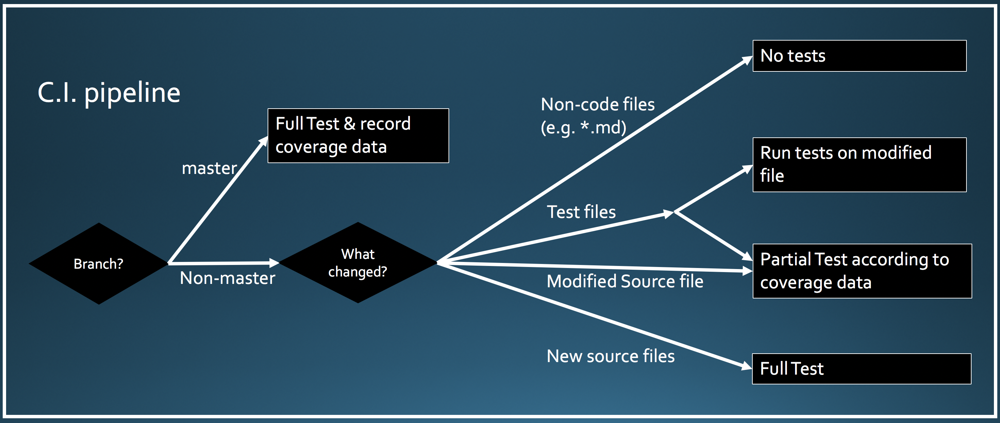

# Partial Testing

Continuous Integration practices enable the frequent and verified (built and tested) contribution of code to shared repositories. But, as projects grow, so do their test suites and the time it takes to run them.
Small and contained changes do not require all tests to be run, most of them would not be relevant. To improve developer productivy and reduce resource usage, we have implemented **Partial Testing**.
By recording coverage data from previous runs, it identifies which tests should be run for each new change or pull-request.


To maintain coverage data up-to-date, and to ensure all tests are still occasionally run, master branch builds execute the entire test suite while recording coverage at the same time. The coverage data from the master branch is saved as a `.coverage` file (which is a sqlite DB file from [coveragepy>=5.0](https://github.com/nedbat/coveragepy), details available [here](https://nedbatchelder.com/blog/201810/who_tests_what_is_here.html)) and non-master branches utilize that file to run only the relevant tests for the changes included in the branch.


For simplicity, we consider a file as the smallest possible changed unit (instead of doing it at the line level). That is, if a line has changed, it is treated as if the entire file has changed.
This approach reduces the complexity of Partial Testing and provides a wider safety net against filtering out tests that were actually relevant.





As shown on the image above, once a file has been modified, a few different testing scenarios arise according to the type of the file. It is also possible that a combination is required.
The different file types are as follows:

* Partial Testing only works with projects that are in **git**.

### Source Code File
Includes any file that contains code and is not part of the test suite. They usually have the Python extension, `.py`, but could also have `.cpp`, `.c`, etc. instead.

When modified:

a) check the saved coverage data to find all relevant tests (test names).

b) For each test name, find which file has its definition.

c) feed `pytest` (or any other testing tool) the files from step b.

When a new file is added, the complete test suite must be run.

### Test Code File
Includes any file that contains code and is part of the test suite, by default it includes all python files under `tests/`. They have the Python extension `.py`. When modified, run all the tests contained within the changed file.

When a new test file is added, all the tests within itself must be run. When one is deleted, no tests from it need to be run.

Additionally, some files under the tests directory might be utility files that get imported by other test files. Because of this, for modified test files, we need 2 steps:

a) check which tests use the file (just like non-test code files)

b) run the tests within the modified file


### Special/Config File
Includes any file that does not contain code but affects the way code is run. Examples: `setup.cfg`

When modified or when a new one is added, all tests need to be run.

Each project should have the ability to specify which files and/or file extensions should be considered special files, see below for details.

We have included `conftest.py` (pytest) under this category of files, even though it initially looks like a code file (.py) or a test file (it sits under the test directories).

### Non-Code File
Includes any file that does not contain code. For example, README or `.md` files.

When modified or a new one is added, no tests need to be run.

In Summary,


|           | Source Code Files           | Test Files                                             | Non-Code Files  | Special/Config Files |
|-----------| --------------------------- | ------------------------------------------------------ | --------------- | -------------        |
| Extension | .py, .cpp, .c               | .py                                                    | .md             |.cfg                  |
| Modified  | Run tests that use the file | Run tests a) within modified file b) that use the file | Don't run tests |Run all tests         |
| Added New | Run all tests               | Run tests within new file                              | Don't run tests |Run all tests         |
| Deleted   | Run tests that use the file | Do not run that file                                   | Don't run tests |Run all tests         |


### Usage

Installation

```
pip install partialtesting  # soon to be published in pypi
```

Once installed, the binaries `partialtest` and `partialtesting` (they are identical, the later is kept for compatibility) become available in your virtual environment:

```
$ partialtesting --help
Usage: partialtesting [OPTIONS]

  Partial Testing (PT) identifies which tests need to be run for a given
  change set, improving the speed of testing, developer productivity and
  resource usage. To achieve this, PT relies on enriched coverage data
  generated before hand, generally by a master-branch build running on a CI
  (e.g. Jenkins).

  PT expects to find the coverage data in a directory with the below
  pattern: <coverage_dir>/<project_name>. Use the options for this script to
  specify them

  More information available in the README.

Options:
  --coverage-dir TEXT        Path to the saved coverage data. Set a default
                             path by setting the below in ~/.partialtesting:
                             [coverage] dir=<path>

  --project-name TEXT        Project name (e.g. numpy).The name will be used
                             to get the path to the coverage data for this
                             project:
                             <coverage_dir>/<project_name>/.../.coverage
                             [required]
```

#### Partialtesting Locally

This sections shows how to use `partialtesting` locally, but its convenience and benefits are maximized when used with a continuous integration system (CI), like Jenkins. That will be explained in the section below.

To use `partialtesting` locally, specify the directory in which the coverage data will be stored. That is, the coverage data generated during a previous run of the entire test suite or from a master build, more details in the CI section above.

As an example, say your project's code repository (git) is as follows:
```
$ tree
├── code1.py
├── code2.py
├── .coveragerc  # explained below
└── tests
    ├── __init__.py
    └── test_code1.py
```

and the files have the following content:

```
$ cat code1.py
def myfunc1():
    print('in myfunc1')

def myfunc2():
    print('in myfunc2')
    myfunc3()

def myfunc3():
    print('in myfunc3')
```

```
$ cat code2.py
def myfunc4():
    print('in myfunc4')
```

```
$ cat tests/test_code1.py
import code1

def test_code1():
    code1.myfunc1()

def test_code2():
    code1.myfunc2()
```

Now, run the entire test suite to generate the coverage data that `partialtesting` will use.

```
$ pip install coverage>=5 pytest
$ PYTHONPATH='.' coverage --branch run -m pytest tests/
================================================================================== test session starts ===================================================================================
platform darwin -- Python 3.8.1, pytest-5.4.1, py-1.8.1, pluggy-0.13.1
rootdir: /Users/fersarr/workspace/fake_project
collected 2 items

tests/test_code1.py ..                                                                                                                                                             [100%]

=================================================================================== 2 passed in 0.01s ====================================================================================
```

Make sure you have `coverage>=5.0` and a `.coveragerc` file telling coverage to record test contexts ([read more here](https://nedbatchelder.com/blog/201810/who_tests_what_is_here.html))

```
$ cat .coveragerc
[run]
dynamic_context = test_function
```

The `coverage ... pytest` command should have generated a `.coverage` file, which is a SQLite database:

```
$ sqlite3 .coverage ".tables"
arc              coverage_schema  line_bits        tracer
context          file             meta
```

Now, move the `.coverage` file into a directory that will hold coverage data for this project:
```
$ mkdir -p saved_coverage/fake_project/ && cp .coverage saved_coverage/fake_project/
$ tree
├── saved_coverage
│   └── fake_project
│       └── .coverage
```

Okay, everything is set and ready for `partialtesting` to work, so let's modify a file and run `PT`.

Modified a code file by adding one line:
```
$ git diff
diff --git a/code1.py b/code1.py
index faecfed..40f81cc 100644
--- a/code1.py
+++ b/code1.py
@@ -1,5 +1,6 @@
 def myfunc1():
     print('in myfunc1')
+    print('changing myfunc1')
```

Run `partialtesting`:

```
$ partialtest --coverage-dir saved_coverage --project-name fake_project --compare-to-branch master
...
INFO:root:Partial Testing: using coverage file 'saved_coverage/fake_project/.coverage'
...
INFO:root:Creating file test_files_to_run.txt
INFO:root:Partial Testing: relevant test files:
tests/test_code1.py
```

As `PT` tells us, for the change we made, we need to run the tests in `tests/test_code1.py`.

#### Partialtesting on a CI (e.g. Jenkins)

As mentioned above, partialtesting can be used in a Continous Integration system (CI), like Jenkins to improve resource usage and reduce build time. The process is similar to running it locally as explained in the section above, but the difference lies in setting up the master branch to produce the coverage data `.coverage` and saving it in an accessible directory so that non-master branches can run `partialtesting` and use it.

1) Run the full test suite with coverage in the master branch and save the `.coverage` file to a path:

```
$ coverage run -p --branch pytest tests/
$ cp .coverage jenkins/saved_coverage/project_x/907/  # build number 907
```

Reminder: add/create a `.coveragerc` file as exlpained above to save test contexts with the coverage data.

2) Use `partialtesting` on the non-master branch to get a list of the tests that should be run given the changes in the branch.

```
partialtesting --project-name project_x --coverage-dir /jenkins/saved_coverage/ --git-diff-use-head --special-files "'setup.py', 'setup.cfg'" --special-extensions "'.pkl', '.h5', '.csv'"
```

The list of tests that need to be run is output to the file `test_files_to_run.txt` (customisable via `--output-file`)

Feed those tests to `pytest` or your preferred testing tool.

## Acknowledgements

Partial Testing has been under active development at [Man Alpha Tech](http://www.man.com/) since 2019.

Original concept and implementation: [Fernando Saravia Rajal](https://github.com/fersarr)

Contributors:

 * [Fernando Saravia Rajal](https://github.com/fersarr)

 * [Luke Fitzgerald](https://github.com/lwfitzgerald)


## Related Links

[who-tests-what in coverage.py](https://nedbatchelder.com/blog/201612/who_tests_what.html)

[who-tests-what is here coverage v5](https://nedbatchelder.com/blog/201810/who_tests_what_is_here.html)

[who-tests-what empty context names](https://github.com/nedbat/coveragepy/issues/796)

[slower tests when recording coverage context](https://github.com/nedbat/coveragepy/issues/793)

[pytest-testmon](https://github.com/tarpas/pytest-testmon)

[pytest-testmon pycon video](https://www.youtube.com/watch?v=nrSZthcAN2U)

[who-tests-what issue with old-style classes in PY2](https://github.com/nedbat/coveragepy/issues/797)
